# Phase-Locked-Loop
### Modem Design

#### PLL Input Signals:
1. Sinusoid Input
2. Noisy Sinusoid Input
3. Noisy Sinusoid Input with Reduced Bandwidth

## PLL Architecture
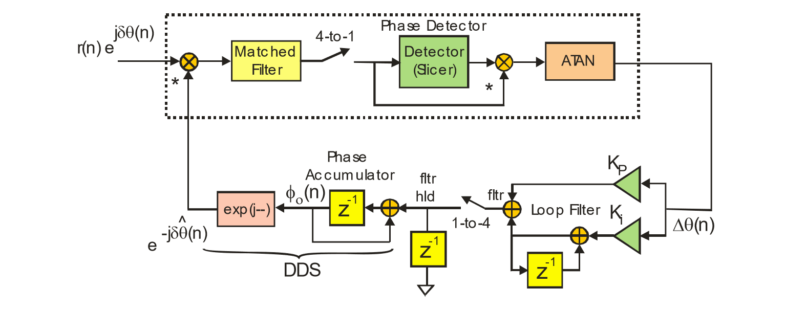

## Sinusoid Input
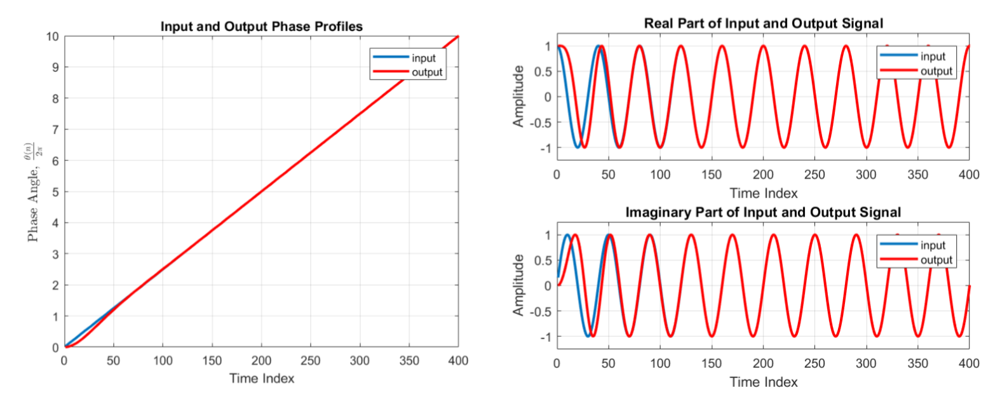
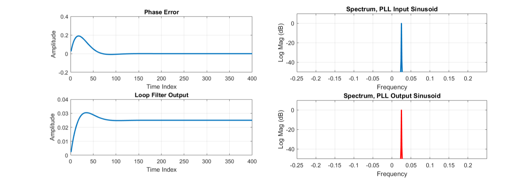

## Noisy Sinusoid Input
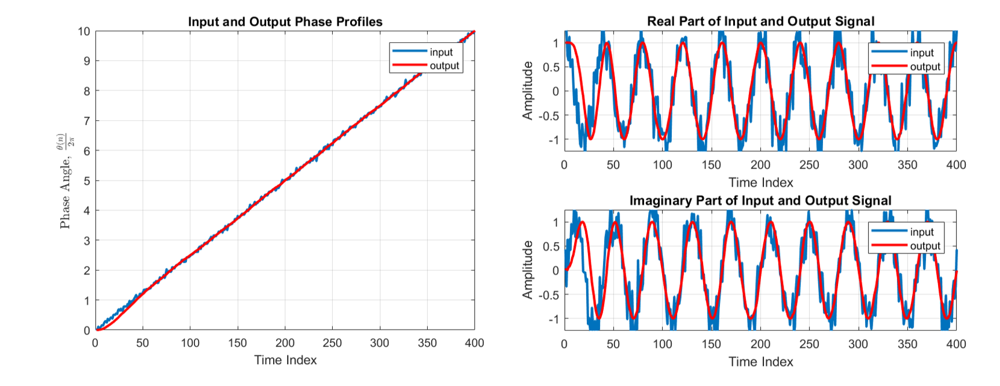
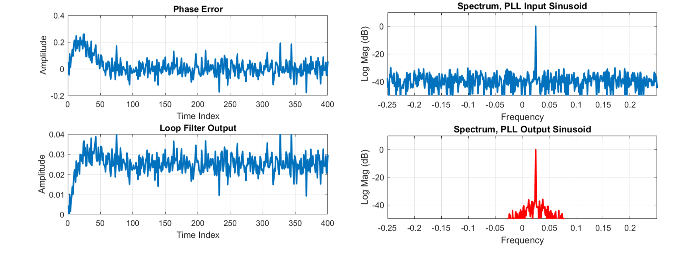

## Noisy Sinusoid Input with Reduced Bandwidth

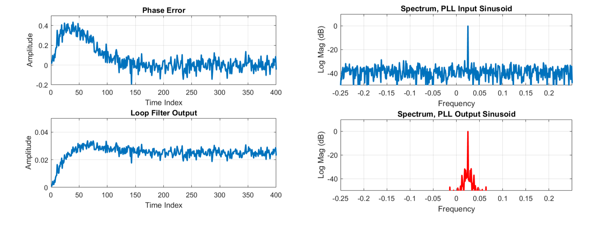

## Modulated Signal
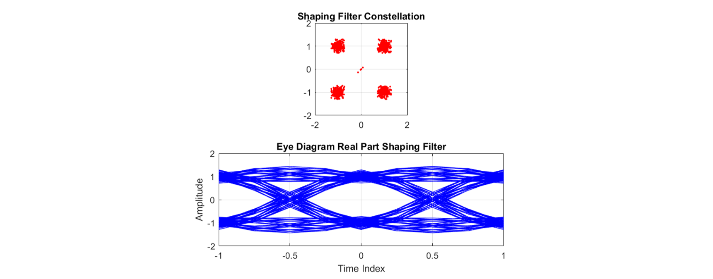

## Recieved Signal
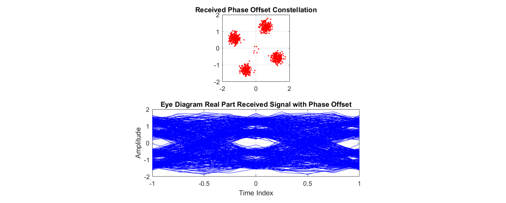

## Matched Filter Output Signal
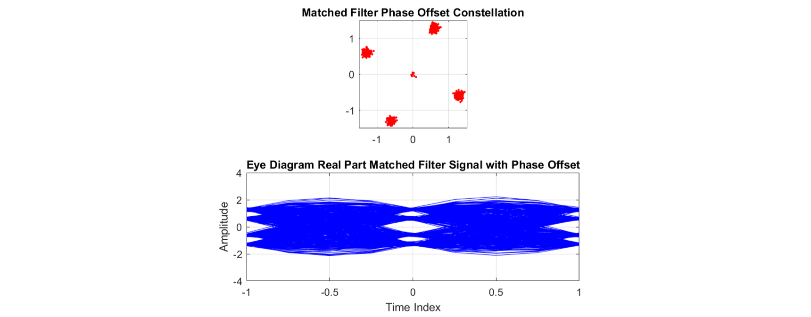

## 2D Slicer
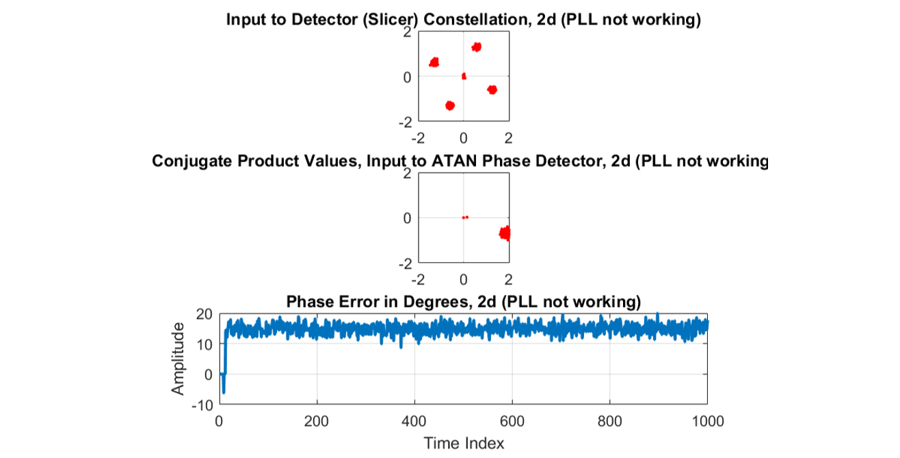

## Input to Detector
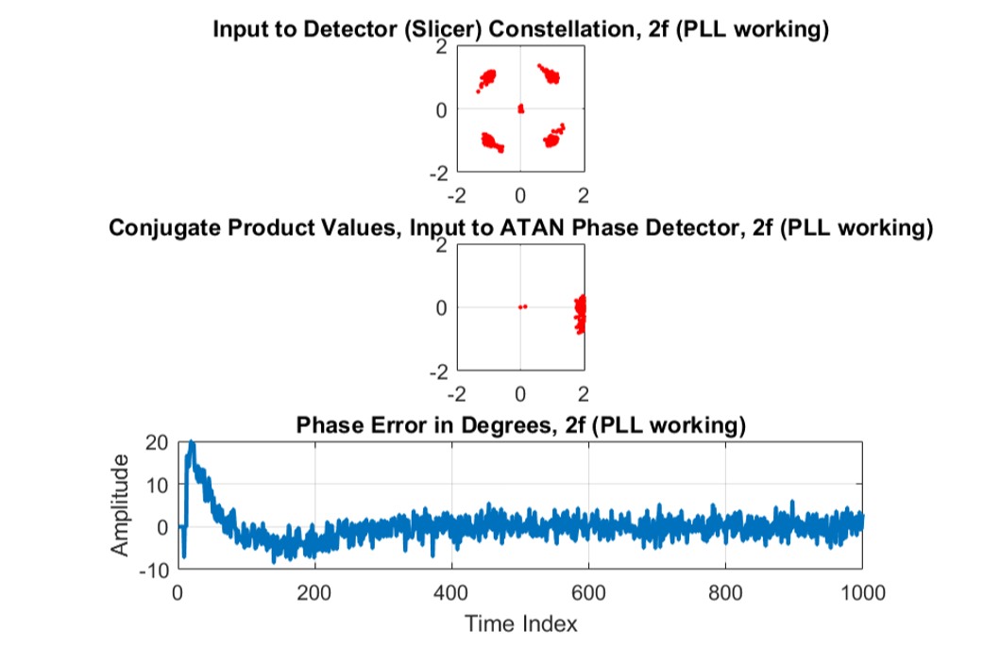
