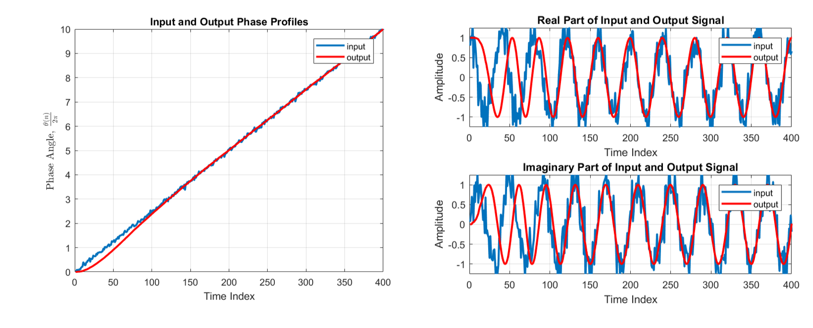

# Phase-Locked-Loop
### Modem Design

#### PLL Input Signals:
1. Sinusoid Input
2. Noisy Sinusoid Input
3. Noisy Sinusoid Input with Reduced Bandwidth

## PLL Architecture

## Sinusoid Input

## Noisy Sinusoid Input

## Noisy Sinusoid Input with Reduced Bandwidth

## Modulated Signal

## Recieved Signal

## Matched Filter Output Signal

## 2D Slicer

## Input to Detector

